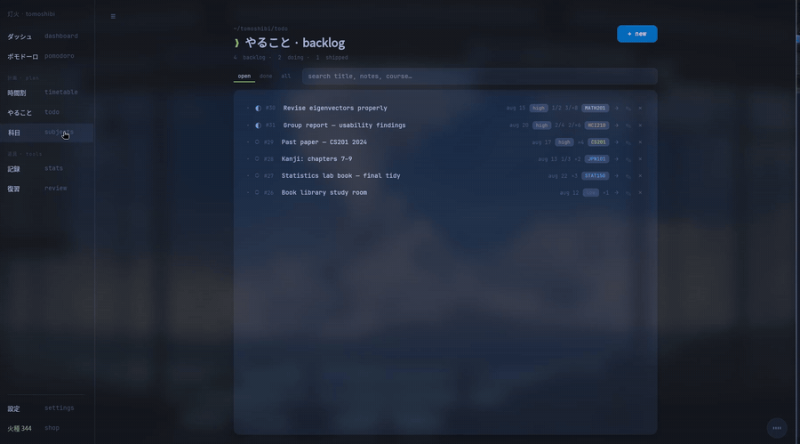
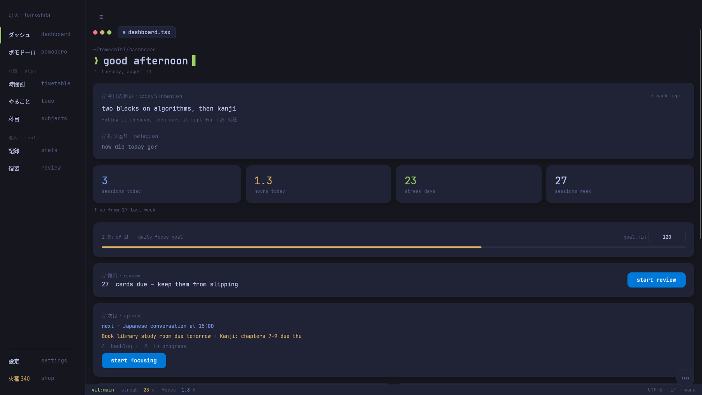
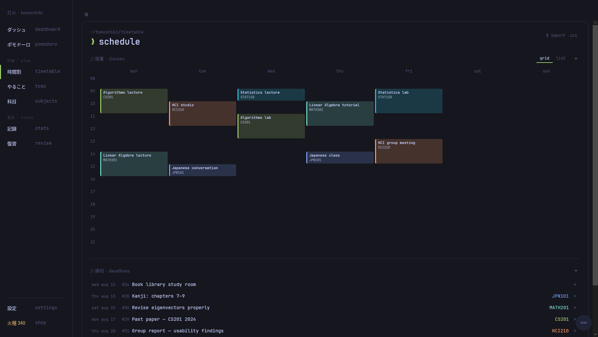
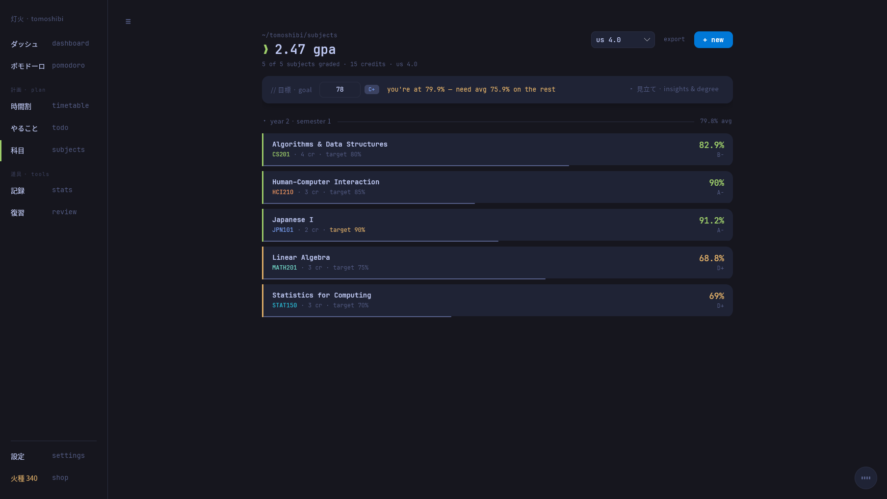
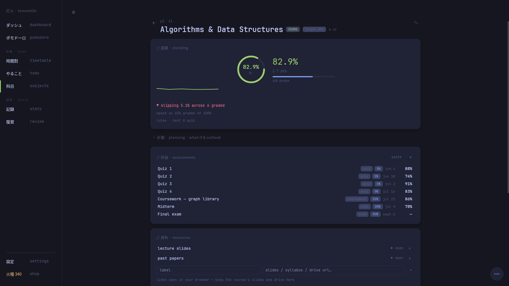
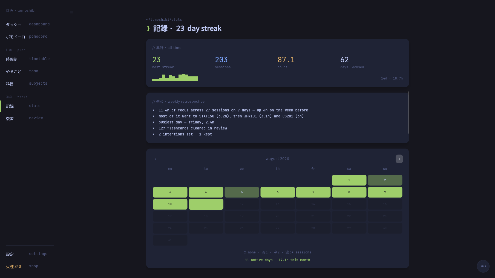
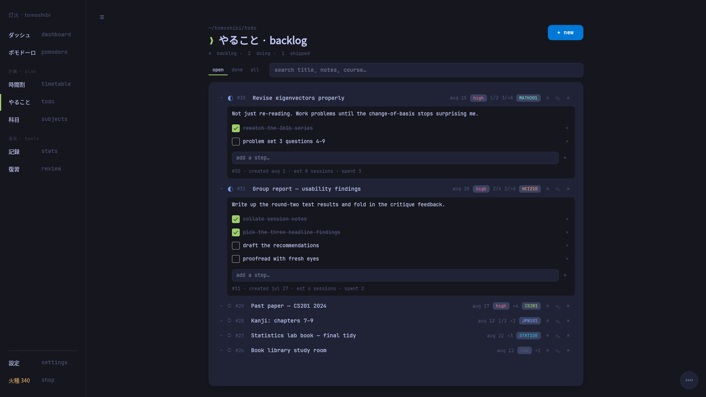
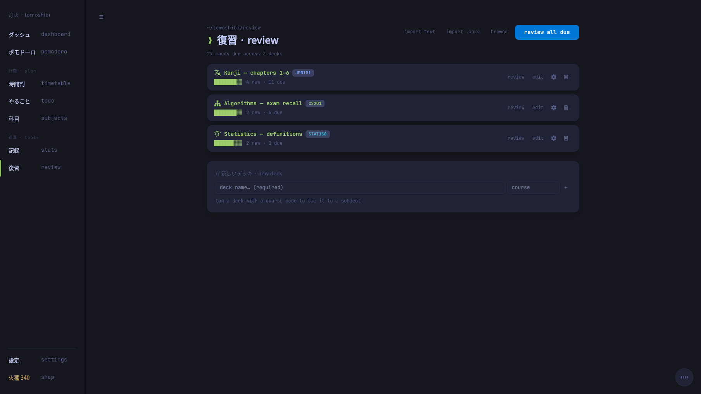
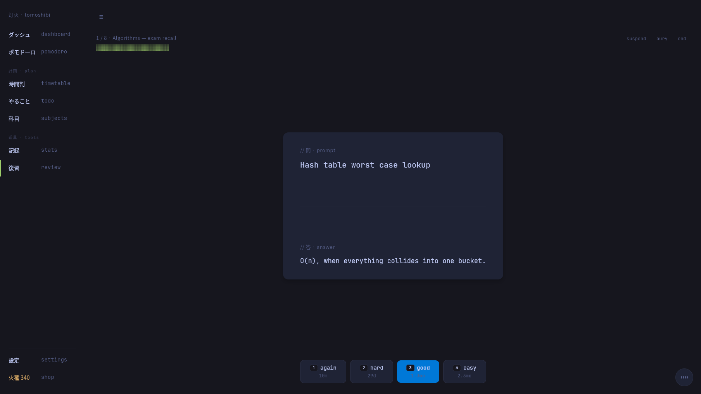

# tomoshibi 灯火

[](https://github.com/socom1/Tomoshibi/actions/workflows/ci.yml)

**A calm, late-night study companion for university students.**

Most study tools make you choose: a timer here, flashcards there, a spreadsheet
for grades, a calendar for deadlines. Tomoshibi is the one window where those
stop being separate. A Pomodoro timer and a daily intention sit at the centre;
around them are your class timetable, a coursework backlog, spaced-repetition
flashcards, weighted grades and a focus journal — gathered on a morning
dashboard, reachable from a `Cmd/Ctrl+K` palette, and wired together so a
finished focus block lands against the right course without you filing it.

No account. No sync. No telemetry. Everything is one JSON file on your own
machine, and it works with the wifi off.

> *tomoshibi* (灯火) — a small light or lamp; the bit of light you keep on while
> you work into the night.



## Features

- **Dashboard** — a morning landing page that pulls a glance together: today's
  intention and focus, the week's momentum, the next seven days' agenda, what's
  due, your grade standing, the subjects that need work, and quick links.
- **Pomodoro timer** — focus/break cycles with a longer break after every Nth
  round, a soft chime and a native notification on phase change, auto-continue,
  and a progress bar. The active task can override the phase lengths, and a
  global hotkey (`ctrl+alt+P` / `⌃⌥P`) starts or pauses from any app.
- **Zen mode** — full-screen, just the clock, your intention and the controls.
- **Daily intention & journal** — one line to set the day's focus, an
  end-of-day reflection on how it went; both bank into a journal look-back at
  the midnight rollover.
- **Tasks as code** — today's plan written in a tiny template grammar
  (`// title`, `study: 25`, `course: MATH101`, `done`), edited in a simple
  list, a form, or raw source. Click a task to make it drive the timer.
- **Timetable** — weekly class schedule on a week grid (or list) plus dated
  deadlines, with `.ics` import for university timetable exports. While a
  class is on, the timer offers it as a one-click focus so the session lands
  on the right course.
- **Todo backlog** — longer-horizon coursework as numbered tickets with
  statuses, priorities, due dates, effort estimates and subtask checklists;
  send an item to today's plan with one click.
- **Subjects & grades** — track assessments per subject against a grade scale
  (US GPA, letter bands or your own custom boundaries), weight years, set an
  overall goal and see what each remaining piece needs to hit it.
- **Flashcards** — spaced-repetition decks scheduled by **FSRS**, the same
  modern algorithm Anki uses. If you've used Anki the loop will feel familiar:
  again / hard / good / easy, each button showing the interval it buys you.
  Cloze deletions, image occlusion, note types that generate several cards, and
  a searchable card browser. **Import your existing collection** — `.apkg`
  files are read directly, and Anki-compatible text imports and exports both
  ways. Tomoshibi isn't affiliated with Anki; it reads its files because that's
  where everyone's decks already are.
- **Focus stats & streak** — a month calendar tinted by focus, current and best
  streak, a 14-day sparkline, focus-by-course, an auto-written weekly
  retrospective, and the journal look-back.
- **Command palette** — `Cmd/Ctrl+K` to jump to any page, run a quick action,
  or search straight to a subject, todo ticket, deck or past reflection.
- **Deadline reminders** — desktop notifications as exams and due dates
  approach, fired once on the way in and again on the day.
- **Themes & embers** — earn embers as you focus and spend them in a small shop
  on extra colour themes; a music player can loop a local folder while you work.
- **Local-first** — all data in a single JSON file on your computer, written
  atomically with a `.bak` fallback; no account, no telemetry. One-click backup
  to a file of your choosing, and restore reads it straight back. The one
  optional network touch is a launch-time update check — a single version ask
  of GitHub you can switch off.

What's planned next is in [docs/ROADMAP.md](docs/ROADMAP.md); what's already
changed is in [CHANGELOG.md](CHANGELOG.md).

## Screenshots

| | |
|---|---|
|  |  |
|  |  |
|  |  |
|  |  |

## Tech

Avalonia + .NET 8, MVVM with CommunityToolkit.Mvvm. One codebase, published
self-contained for Windows, macOS and Linux. The rules that matter — the
Pomodoro state machine, the FSRS scheduler, the grade engine, the importers —
are pure types with no UI attached, which is why 232 tests can drive them.
Architecture notes are in [docs/ARCHITECTURE.md](docs/ARCHITECTURE.md); how to
report a vulnerability is in [SECURITY.md](SECURITY.md).

## Project layout

```
Tomoshibi.sln
src/Tomoshibi/
  Models/        data classes (AppState, ClassSlot, TodoItem, Subject,
                 Deck, DayNote, …)
  Services/      side effects behind interfaces (storage, sound, music,
                 notifications + reminders) plus the pure logic: the
                 Pomodoro state machine, the FSRS scheduler, the task-template
                 parser, the .ics importer, the .apkg and text deck
                 readers/writers, grade scales, the weekly retrospective
                 writer, the daily reset and the state migrations
  ViewModels/    UI state + behaviour, one per destination + the shell
  Views/         .axaml UI (MainWindow shell + one view per destination:
                 Dashboard, Today, Timetable, Todo, Subjects, Stats,
                 Review, Shop, Settings)
  Styles/        Tokyo Night palette + control styles
  Assets/        icon (png/ico/icns) + chime
tests/Tomoshibi.Tests/   232 xUnit tests over the pure logic (Pomodoro state
                 machine, FSRS scheduler, grade engine, task-template parser,
                 storage round-trip + crash recovery, daily reset, state
                 migrations, .ics importer, deck files, card generation,
                 cloze + occlusion, search parser, weekly retrospective)
scripts/         packaging scripts per platform
docs/            roadmap, architecture, screenshots
.github/workflows/ci.yml   build + test on every push/PR, across win/mac/linux
```

## Download & install

Grab the build for your OS from the
[releases page](https://github.com/socom1/Tomoshibi/releases/latest), unzip,
and run. The builds are self-contained — no .NET install needed.

The builds aren't code-signed (yet), so on first launch your OS will be
suspicious on your behalf:

- **macOS** — Gatekeeper says the app "cannot be opened because it is from an
  unidentified developer". Right-click the app → **Open** → **Open** once;
  after that it launches normally.
- **Windows** — SmartScreen shows "Windows protected your PC". Click
  **More info** → **Run anyway** once.

- **Linux** — no warning to click through. Extract the tarball anywhere and
  run `Tomoshibi`, or drop `tomoshibi.desktop` into
  `~/.local/share/applications` (fix its `Exec`/`Icon` paths to wherever you
  extracted) to get it in your app menu.

The app tells you in settings when a newer release is out (you can turn that
check off).

**On Linux, install `libvlc` for audio.** The build carries everything else,
but the media service loads the system libvlc — without it the app runs fine
and simply stays quiet: flashcard audio and video, and the music player, do
nothing. On Arch that's `sudo pacman -S vlc`; on Debian/Ubuntu,
`sudo apt install libvlc-dev vlc`.

## Building from source

You'll need the [.NET 8 SDK](https://dotnet.microsoft.com/download/dotnet/8.0).

```bash
git clone https://github.com/socom1/Tomoshibi.git tomoshibi
cd tomoshibi
dotnet restore
dotnet run --project src/Tomoshibi
```

Run the tests with:

```bash
dotnet test
```

## Building a release

Use the packaging scripts — they handle the per-platform wrapping:

```bash
# macOS: (tested)
./scripts/pack-mac.sh

# Linux: tar.gz with a .desktop launcher (tested on Arch)
./scripts/pack-linux.sh

# Windows: zip of a self-contained folder (tested)
pwsh scripts/pack-win.ps1
```

> Note: avoid `-p:PublishSingleFile=true` on macOS — SkiaSharp's native
> library doesn't survive single-file extraction there, which is why
> `pack-mac.sh` ships the publish folder inside the .app instead.

## Where your data lives

A single `tomoshibi.json` file in your OS application-data folder:

- Windows — `%APPDATA%\Tomoshibi\`
- macOS — `~/Library/Application Support/Tomoshibi/`
- Linux — `~/.config/Tomoshibi/`

Delete it to reset the app to a clean state. When something goes wrong a log
lands in the same folder — `crash-*.log` if the app went down, `error-*.log` if
it caught the problem and carried on. Settings → open folder takes you there;
attaching the newest one to an
[issue](https://github.com/socom1/Tomoshibi/issues) makes the bug far easier to
catch. Found a security problem instead? [SECURITY.md](SECURITY.md) has the
private reporting route.

## License

Source-available — you're welcome to download, build and run tomoshibi
for yourself, but not to redistribute copies or reuse the code elsewhere.
See [LICENSE](LICENSE). Releases up to v1.9.0 remain MIT.
